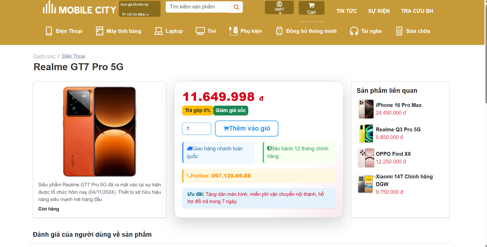
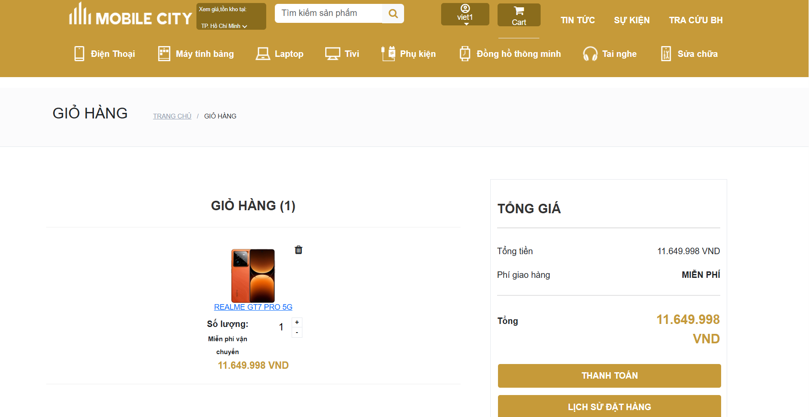
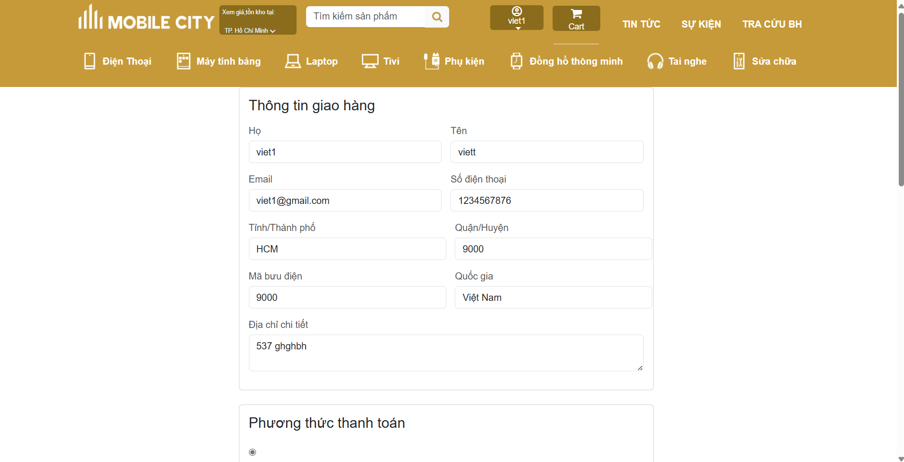
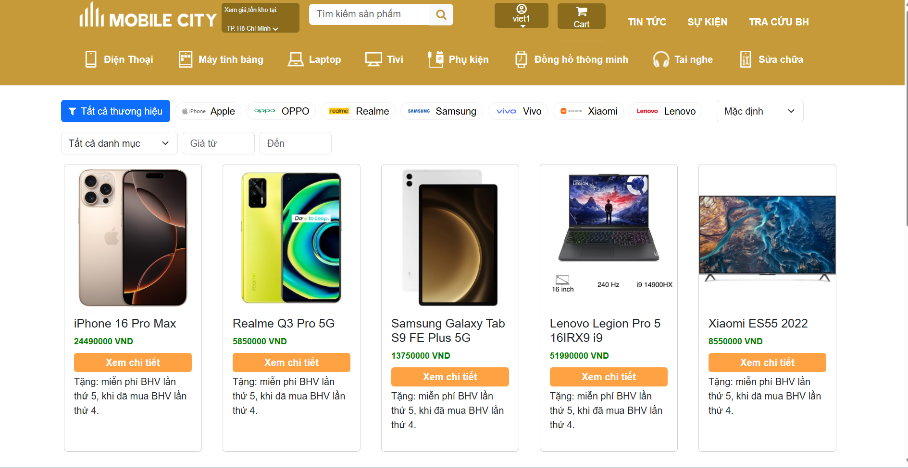
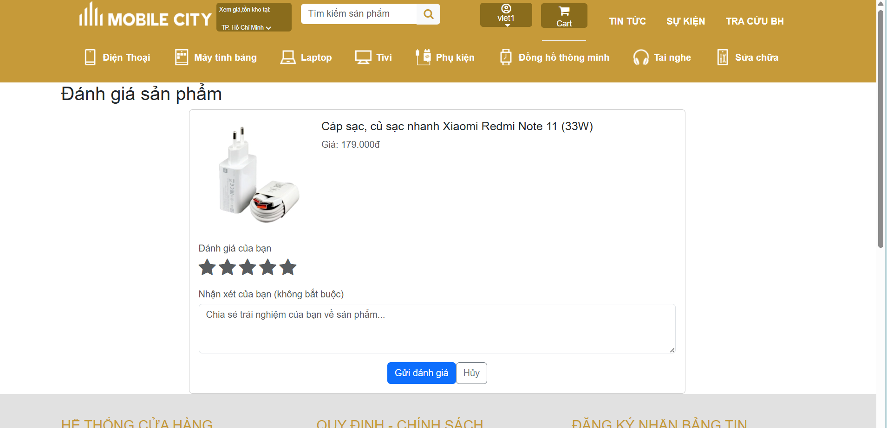
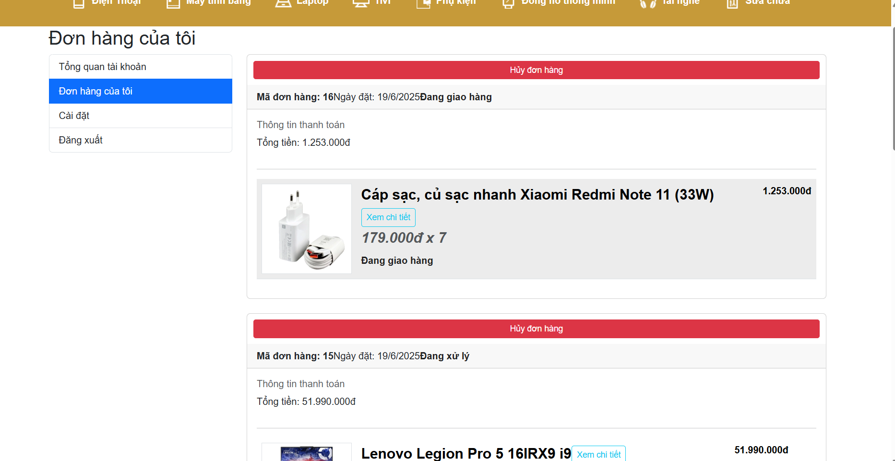
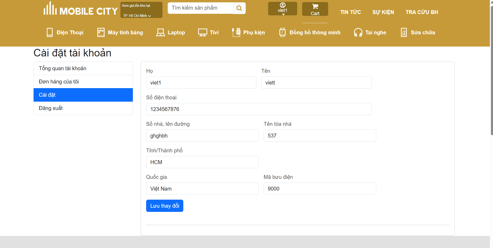

# MobileCity - Hệ Thống Bán Hàng Điện Tử Kiến Trúc Microservice

## 🚀 Tính Năng Chính

### 1. Quản Lý Sản Phẩm
- Danh mục sản phẩm đa cấp
- Tìm kiếm và lọc sản phẩm thông minh
- Đánh giá và bình luận sản phẩm

### 2. Hệ Thống Đặt Hàng
- Giỏ hàng phân tán với Redis
- Đa dạng phương thức thanh toán
- Theo dõi đơn hàng thời gian thực

### 3. Quản Lý Người Dùng
- Đăng ký/đăng nhập đa nền tảng
- Phân quyền người dùng chi tiết
- Lịch sử mua hàng

### 4. Hệ Thống Gợi Ý
- Đề xuất sản phẩm dựa trên lịch sử
- Sản phẩm thường được mua cùng nhau

## 🛠 Công Nghệ Sử Dụng

### Backend
- **Spring Boot** - Framework chính
- **Spring Cloud** - Xây dựng kiến trúc microservice
- **Spring Security** - Xác thực và phân quyền
- **Spring Data JPA** - Truy vấn dữ liệu
- **Eureka Server** - Service discovery
- **API Gateway** - Định tuyến request

### Cơ Sở Dữ Liệu
- **MySQL** - Cơ sở dữ liệu chính
- **Redis** - Caching và giỏ hàng

### Frontend
- **React.js** - Thư viện JavaScript cho giao diện người dùng
- **React Admin** - Framework xây dựng admin dashboard
- **Redux** - Quản lý state ứng dụng
- **Material-UI** - Thư viện component UI
- **Axios** - Xử lý HTTP requests
- **React Router** - Điều hướng trang

### Khác
- **JWT** - Xác thực token
- **RESTful API** - Giao tiếp giữa frontend và backend

## 🌐 Giao Diện

### Trang Người Dùng (React)

#### 1. Trang Chủ

- Hiển thị sản phẩm nổi bật
- Danh mục sản phẩm
- Sản phẩm mới nhất
- Khuyến mãi đặc biệt

#### 2. Chi Tiết Sản Phẩm

- Thông tin chi tiết sản phẩm
- Hình ảnh sản phẩm
- Đánh giá từ người dùng
- Sản phẩm liên quan

#### 3. Giỏ Hàng

- Xem và chỉnh sửa giỏ hàng
- Áp dụng mã giảm giá
- Tính tổng tiền
- Đi đến thanh toán

#### 4. Thanh Toán

- Thông tin giao hàng
- Phương thức thanh toán
- Xác nhận đơn hàng

#### 5. Tìm Kiếm Sản Phẩm

- Tìm kiếm nhanh
- Bộ lọc sản phẩm
- Sắp xếp kết quả

#### 6. Đánh Giá Sản Phẩm

- Xem đánh giá
- Viết đánh giá
- Xếp hạng sao

#### 7. Lịch Sử Đơn Hàng

- Theo dõi đơn hàng
- Chi tiết đơn hàng
- Trạng thái vận chuyển

#### 8. Thông Tin Cá Nhân

- Cập nhật thông tin
- Đổi mật khẩu
- Địa chỉ giao hàng

### Trang Quản Trị (React Admin)
- Quản lý sản phẩm
- Quản lý danh mục
- Quản lý thương hiệu
- Quản lý đơn hàng
- Quản lý đánh giá và bình luận
- Phân quyền quản lý người dùng

### Yêu Cầu Hệ Thống
- Java 11+
- Docker và Docker Compose
- MySQL 8.0+
- Redis
- Maven

### Cài Đặt
- Clone dự án:
- git clone [https://github.com/Viet1181/MobileCity-Microservice.git]
  
